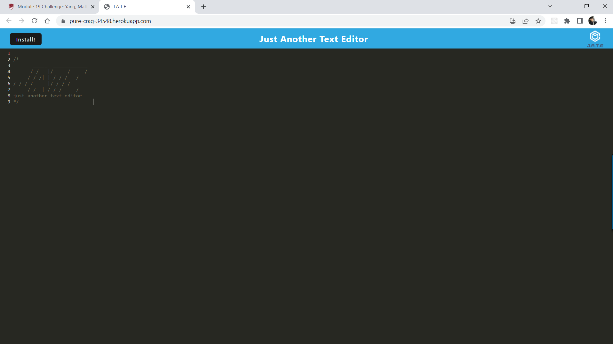

## myTextEditor

---

## Table on Contents

1. [License](#License)
2. [Description](#Description)
3. [Installation](#Installation)
4. [Usage](#Usage)
5. [Contributing](#Contributing)
6. [Tests](#Tests)
7. [Questions](#Questions)

---

## License

---

## Description

This applications build an online text editor as a progressive web app (PWA). This application uses both frontend and backend techologies such as , express.js, node.js, webpack, babel, idb, and indexdb to store data straight fro the browser.

---

## Installation

Launch app here: https://pure-crag-34548.herokuapp.com/

---

## Usage

Use text editor from live deploy.

---

## Contributing

Clone repository and contribute if desired.

---

## Tests

Not applicable

---

## Questions

For more information and questions please email me @ yangmatthew85@gmail.com

[GitHub: myang5t3r](https://github.com/myang5t3r)

---
